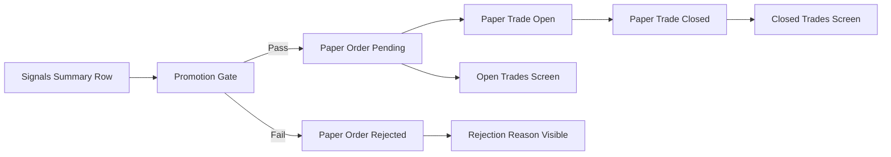

# Phase 3: Automated Paper Execution - Context

**Gathered:** 2026-04-25  
**Status:** Ready for planning  
**Source:** [`steadyalpha-single-user-trading-copilot-plan.md`](steadyalpha-single-user-trading-copilot-plan.md), [`steadyalpha-master-roadmap.md`](steadyalpha-master-roadmap.md), [`ROADMAP.md`](.planning/ROADMAP.md), [`REQUIREMENTS.md`](.planning/REQUIREMENTS.md)

## Phase Boundary
This phase converts signal recommendations into deterministic paper-order lifecycle records and exposes full operator visibility for inspection.

Deliverables:
- `paper_orders` and `paper_trades` schema and lineage.
- Promotion gating from recommendation to paper order.
- Open and closed paper-trade screens with source-signal traceability.

## Requirements In Scope
- **REQ-301:** `paper_orders` and `paper_trades` must track tool-generated lifecycle.
- **REQ-302:** Promotion logic must gate by regime, confidence, and risk state.
- **REQ-303:** UI must show source signal and sizing basis for every paper trade.

## Core Decisions for This Phase
- Keep paper semantics explicit: no broker-execution language.
- Make promotion deterministic and idempotent per run/symbol/setup.
- Persist rejection reason when a recommendation is not promoted.
- Require full lineage from trade to source signal snapshot and run.

## Sequencing Diagram

## Deferred
- Broker API integration and real execution acknowledgements.
- Multi-user workflows and permissions.
- Live automation controls.

---
*Phase: 03-automated-paper-execution*

